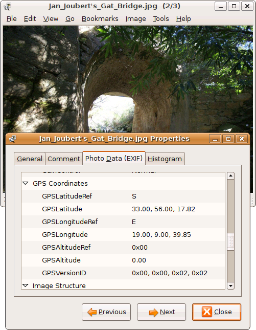

***

<!--
[(https://raw.githubusercontent.com/seanpm2001/CamCamPlus/main/CamCam%2B/EXIF_Location/Geotagging/Media/PNG/Geotagging_gThumb.png)
!-->

# EXIF Data/Geotagging in CamCamPlus/CamCam++

I feel that this data poses a major privacy risk, but it can also be really useful. EXIF data can reveal ones location very easily, as it can reveal your exact geological location in the world. Geotagging is the use of GPS data in images and other media.

I have decided that Geotagging will be disabled by default. A password prompt, confirmation, and root privileges will be required to turn it on or off.

My knowledge on this branched off from researching [Android 11.0](https://en.wikipedia.org/wiki/Android_11#Privacy_and_security). Geotag data can be very useful and is a modern technical feature, but I want to make sure people achknowledge and give consent to it being used first.

You can read more about what Geotagging is [here (Wikipedia)](https://en.wikipedia.org/wiki/Geotagged_photograph) [here (Wikipedia)](https://en.wikipedia.org/wiki/Geotagging) or [Here](https://duckduckgo.com/?q=geotagging&t=h_&ia=web)

***
